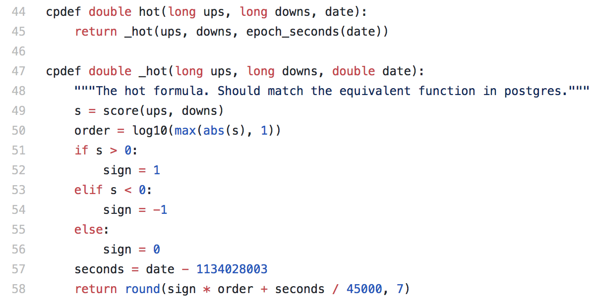
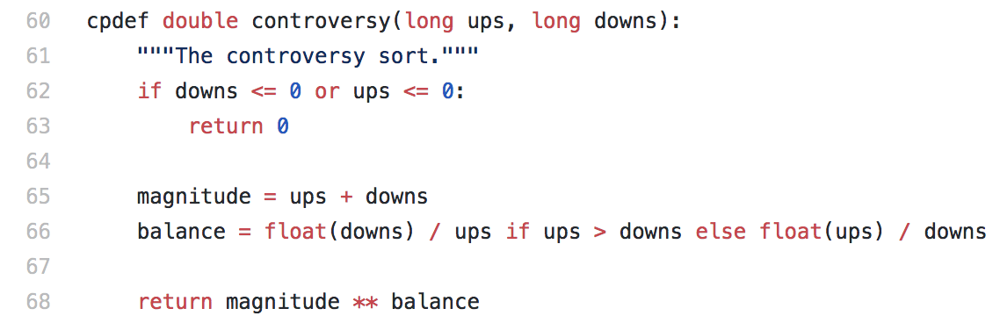
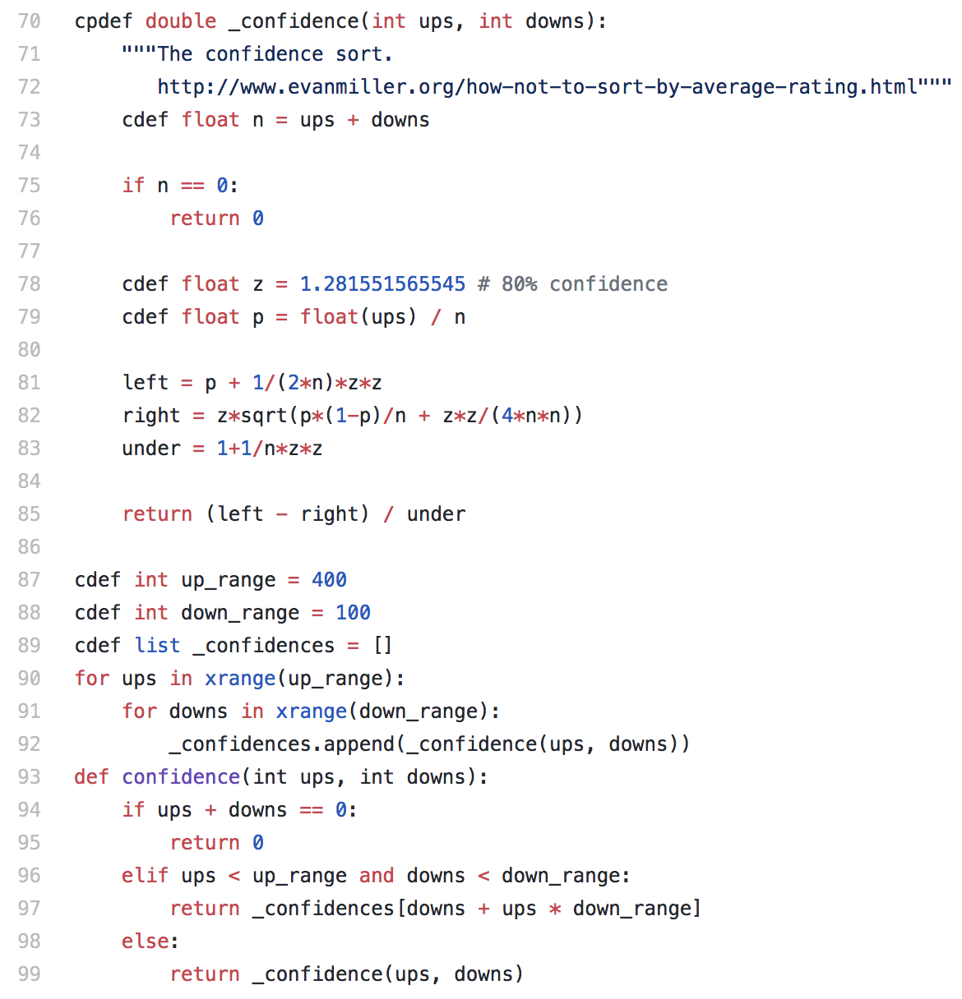
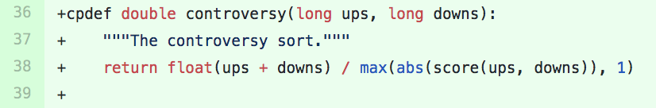

## Welcome to my page!

**Hey there!**
Welcome to my blog where I talk about tech companies that
successfully created a Trust and Reputation System on a large scale.
We'll correctly take a look at [Reddit's](https://reddit.com)
unique system and both, its strengths and shortcomings.

Before we dive into Reddit's system, however, it would be helpful to know what a
Trust and Reputation System is.
It is a
> system that allows users to rate each other on the platform to build trust
> through reputation

### Reddit

Reddit is a community-driven aggregator of content. The social media platform
is separated by subjects like politics, science, tech, etc. and organized into
'subreddits' where users can post content and comment which are then up or
downvoted by other members.

1. [Voting System](#voting-system)
2. [Analysis of how the system changed over the years](#analysis-of-how-the-system-changed-over-the-years)
3. [Current Challenges](#current-challenges)
4. [Conclusion](#conclusion)

## Voting System
Unlike other social networks, Reddit’s voting system is based
on a Karma system. Mainly, it acts as a scoreboard for the platform
which is a reward for posting valuable content. Karma comes in two
forms namely
> link karma
> comment karma

 *Comment karma* is based on the
comments one contributes to posts whereas *link karma* is any links
that one shares. As it turns out, posts are not part of link karma.
In fact, one gets no karma for posts as it initially became an easy
way to accumulate karma without giving anything productive to the
particular subreddit. However, as of July 2016, Reddit said that over
65% of submissions to Reddit come in the form of text-posts. Link
karma is now combined with these self-posts as ‘post karma’ in an
attempt to acknowledge that these posts have played a detrimental
role in growing the platform. A person’s ‘karma’ is a reflection
of their reputation in the community and the value they provide.
This voting system is also meant to increase user engagement.

### The Algorithm behind it
All references to algorithms come from this [repository](https://github.com/reddit-archive/reddit)
[6 months old].
However, it is noted that this is an archived repo meaning
that their latest features and such are closed sourced and
could not be referenced.

Reddit's voting system is based on

#### Story/Post ranking
['Hot ranking'](https://github.com/reddit-archive/reddit/blob/master/r2/r2/lib/db/_sorts.pyx)

##### What does it do?

The hot ranking shows you the latest posts that may catch your attention or are
hot among other redditors.

##### Important factors?

- *Submission time* of post is essential. So much so that newer posts will get
a higher rank than older ones even if up/downvotes are the same.
- *Logarithm scale* is the weighing system for upvotes. This means that the
first 10 upvotes are equivalent to the next 100 upvotes which are the same as
the forthcoming 1000 and so on.
- *Downvotes* are synonymous with Reddit. It is one of the few platforms where
‘dislikes’ can have a tremendous impact. The s variable is determined by taking the
score of up and downvotes. This means that a post with 50 upvotes is equivalent to one with 100 upvotes but 50 downvotes.

['Controversy'](https://github.com/reddit-archive/reddit/blob/master/r2/r2/lib/db/_sorts.pyx)

##### What does it do?

The controversy ranking will present to you the most debatable posts among
the community.

##### Important factors?

- *Downvotes* are used along with upvotes to create the rating. If a post has
many up and downvotes, then it is a controversial story regardless of date.
- A story that has more upvotes will get a higher ranking compared to one with
similar up and downvotes.

#### Comment ranking

['Confidence'](https://github.com/reddit-archive/reddit/blob/master/r2/r2/lib/db/_sorts.pyx)

##### What does it do?

This is an interesting ranking for comments only. It focuses on displaying
top comments sorted by quality and not time of comment.
##### Important factors?

- [Randall](https://en.wikipedia.org/wiki/Randall_Munroe) who created the
webcomic xkcd is the guy behind the new system.
- *Average rating* = positive/total ratings are what most companies use,
although it is a naive ranking [Amazon]
- This sort unlike the previous one which took a bias in submission time is much
better.
- The math for this was already done by Edwin B. Wilson in 1927, and it’s called
“Wilson score interval.”
- This sort creates an ‘opinion poll’ by treating vote count as a statistical
sampling of hypothetical full vote by everyone.

*Sources*:
> [Reddit Blog](https://redditblog.com/2009/10/15/reddits-new-comment-sorting-system/)
>
> [Evan Miller](http://www.evanmiller.org/how-not-to-sort-by-average-rating.html)

## Analysis of how the system changed over the years

### Humble beginnings and initial system

#### Mission Statement
Reddit's mission is to:
> be the front page of the internet

They meant to have one page where people would share external links much like
GitHub storing people's source code on their platform. However, over time
Reddit changed its business model due
to their exponential growth. Whereas before, posts only contained external
links, you now can share "self" posts. A self-post on the platform is a text
post instead of a link post. Thus, users or known as "Redditors" would be able
to share content themselves rather than outsourcing it. The site now is mostly
made up of such posts. Since the platform does not permit for image hosting,
people like [Alan Schaaf](https://en.wikipedia.org/wiki/Alan_Schaaf) focused
on creating an alternative with Imgur. [Imgur](https://imgur.com/)
is an online image sharing community and image host founded by Alan Schaaf.
It is now the de facto website used for Reddit image posts. This shift towards
"self"  and images more rather than providing external URLs led to the
promotion of this self-reinforcing cycle. Over the years, Reddit had to adapt
their voting system not only to accommodate the preference in type of posts but
also to tackle other threats that we will examine next.

### Cause for change
Various reasons led to Reddit changing their business model,
specifically their voting system. One such idea is the use of bots and the
manipulation of the system. Bots are simple to create since Reddit is open
source and provides a readily Application Programming Interface [API] that is
easy to 'talk' to. In turn, many great bots are created such as the ones that
help moderators manage their subreddits. However, this also enabled bots to be
spammers or manipulate posts. One way bots have done so is by being sold as a
service to provide upvotes or downvotes. At face value, this may not seem like
the worst thing to do in the world, but manipulating posts in such a fashion
help push propaganda. For example, [r/Bitcoin](https://www.reddit.com/r/Bitcoin/)
is a favorite subreddit for
cryptocurrencies where there has been an uproar about this particular issue. Bots
essentially helped those masterminds to artificially pump altcoins making them
copious amounts of money in the process. Reddit and other social networks are
built on their reputation and by passively allowing for such people to take
advantage of their system is a significant reason why people would lose trust in the
platform. Problems will always arise with any given platform, so for one that
is built upon their trust and reputation system, it is key to stay authentic
and customer eccentric first. A recent misuse that we have seen of this is
Facebook's
[scandal](https://en.wikipedia.org/wiki/Facebook%E2%80%93Cambridge_Analytica_data_scandal)
with Cambridge Analytica. This made many users think twice about the data
they willingly share with Facebook and all its business partners. As such,
Reddit has to be **different** when it comes to their trust and reputation
model to avoid such situations in the first place.

### Redesign
To prevent the manipulation of posts the front page of the internet responded
by fuzzing upvotes and downvotes like such:

compared to their previous sort algorithm from 2010:

One consequence of the change in this 'controversy' ranking though is that it
unintentionally deflates some scores, thus making it look like it was
mass-downvoted. So, although, Reddit solved one problem, it created another
by questioning the faith in the ratings.

One other change the platform changed was their 'hot' ranking as such:

Previously, the hot ranking would favor recent submissions which would have a
monotonically increasing score. So, the algorithm would pile up newer ones over
old ones. However, they changed that with this update in 2014 making the hot
score continuous.

## Current Challenges
With the growth of users, the diversification of subreddits, and an ever-changing voting
system, Reddit struggles to have a definite right model to make money.
Currently, the company makes their money either through ads or Reddit Gold,
which is their premium subscription. Their users are notorious for trashing ads,
so the site introduced Reddit Gold that helps eliminate seeing ads and offers
other features that supposedly enhance the user experience. Still, Reddit is a
scary place to put ads just due to the backlash from users. So, different ways of
pushing ads or propaganda instead are by posting "self-posts." The challenge for
Reddit is to present a voting system that would prevent such tactics by
creating a viable money making solution which would benefit all parties without
compromising the values of redditors [charging $3.99 to get rid of ads].

## Conclusion
In conclusion, I hope you gained a better understanding of how Reddit's trust
and reputation are built upon their voting system. Furthermore, it is
interesting to see how a system needs to be adapted to change to evolve and
better their structure over time. For example, Reddit did so by changing
their ranking algorithm to account for threats like manipulation of votes
via bots. Overall, Reddit has done a reasonably satisfying job to eliminate these
problems to a minimum.


For more details see [GitHub Flavored Markdown](https://guides.github.com/features/mastering-markdown/).

### jekyll themes

your pages site will use the layout and styles from the jekyll theme you have selected in your [repository settings](https://github.com/babdulkarim/babdulkarim.github.io/settings). the name of this theme is saved in the jekyll `_config.yml` configuration file.

### support or contact

having trouble with pages? check out our [documentation](https://help.github.com/categories/github-pages-basics/) or [contact support](https://github.com/contact) and we’ll help you sort it out.

